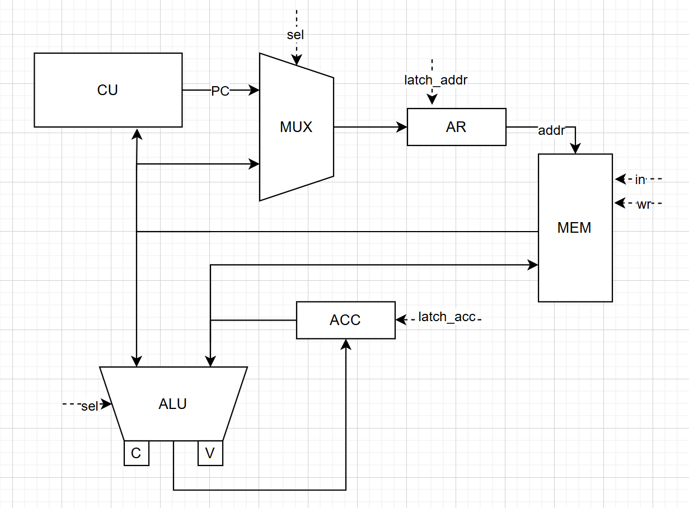
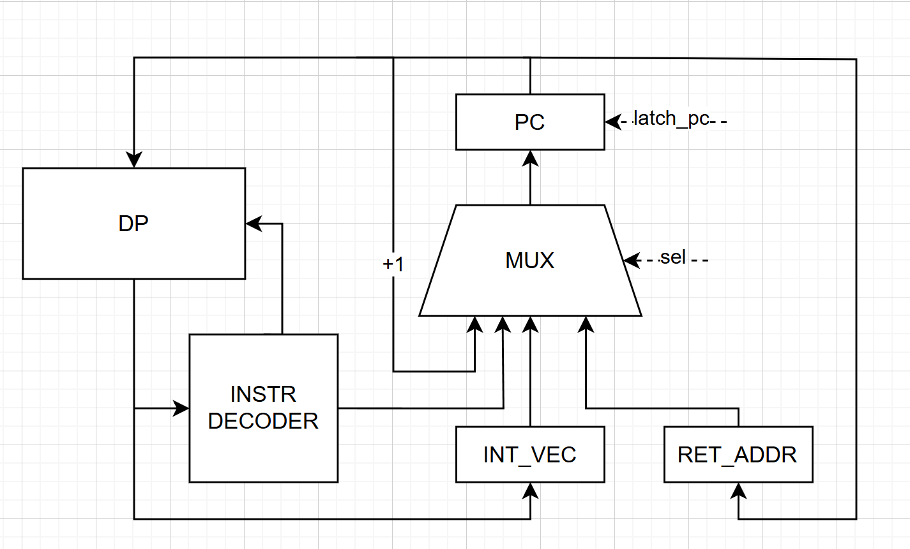

# Лабораторная работа №4

- Выполнил: Кузьмин Артемий Андреевич
- Группа: P3214
- Преподаватьель: Пенской Александр Владимирович
- Вариант: `asm | acc | neum | hw | tick | binary | trap | mem | cstr | prob2 | cache`

## Содержание

- [Язык программирования](#язык-программирования)
- [Организация памяти](#организация-памяти)
- [Система команд](#система-команд)
- [Транслятор](#модель-процессора)
- [Модель процессора](#модель-процессора)
- [Тестирование](#тестирование)

## Язык программирования

### Синтаксис:

``` ebnf
    program ::= data_section | code_section
    
    data_section ::= section_definition
                   | origin
                   | variable
                   | macro
                   | comment
                   
    section_definition ::= ".data" | ".code"

    origin ::= ".org" hex_number
    
    variable ::= label directive value
    
    label ::= <any symbols>:
    
    directive ::= ".word" | ".string"
    
    value ::= int_number | hex_number | "<any symbols>", 0 | label
    
    macro ::= "macro" <any symbols>
            | instruction
            | "endm"
              
    code_section ::= section_definition
                   | origin
                   | label
                   | instruction [ comment ]
                   | comment
                   
    instruction ::= opcode
                  | opcode operand
                  | opcode "[" operand "]"
                  | opcode "*[" operand "]"
                  | opcode operand "(pc)"
    
    opcode ::= "halt"
             | "cla"
             | "clc"
             | "clv"
             | "setc"
             | "setv"
             | "not"
             | "shl"
             | "shr"
             | "asr"
             | "cshl"
             | "cshr"
             | "iret"
             | "ei"
             | "di"
             | "jump"
             | "beqz"
             | "bneqz"
             | "ble"
             | "bgt"
             | "bcs"
             | "bcns"
             | "bvs"
             | "bvns"
             | "and"
             | "or"
             | "add"
             | "sub"
             | "mul"
             | "div"
             | "mod"
             | "load"
             | "save"
             | "setvec"
                  
    operand ::= int_number | hex_number | label
    
    int_number ::= ["-"] { <any of "0-9"> }
    
    hex_number :: "0x" { <any of "0-9a-f"> }
    
    comment ::= ; <any symbols>
```

### Семантика:

- **Инструкции:**
  - **halt** - остановка выполнения
  - **cla** - очистка аккумулятора
  - **clc** - очистка флага переноса
  - **clv** - очистка флага переполнения
  - **setc** - установка флага переноса
  - **setv** - установка флага переполнения
  - **not** - побитовое логическое отрицание значения в аккумуляторе
  - **shl** - логический сдвиг влево
  - **shr** - логическрй сдвиг вправо
  - **asr** - логический сдвиг вправо
  - **cshl** - циклический сдвиг влево
  - **cshr** - циклический сдвиг вправо
  - **iret** - возврат из прерывания
  - **ei** - разрешение прерываний
  - **di** - запрет прерываний
  - **jump addr** - безусловный переход по адресу
  - **beqz addr** - переход, если аккумулятор равен 0
  - **bneqz addr** - переход, если аккумулятор не равен 0
  - **ble addr** - переход, если аккумулятор меньше 0
  - **bgt addr** - переход, если аккумулятор больше либо равен 0
  - **bcs addr** - переход, если выставлен флаг переноса
  - **bcns addr** - переход, если не выставлен флаг переноса
  - **bvs addr** - переход, если выставлен флаг переполнения
  - **bvns addr** - переход, если не выставлен флаг переполнения
  - **and operand** - побитовое И со значением в аккумуляторе
  - **or operand** - побитовое ИЛИ со значением в аккумуляторе
  - **add operand** - сложение со значением в аккумуляторе
  - **sub operand** - вычесть значение из аккумулятора
  - **mul operand** - умножение со значением в аккумуляторе
  - **div operand** - целочисленное деление со значением в аккумуляторе
  - **mod operand** - остаток от деления аккумулятора на операнд
  - **load operand** - загрузить значение в аккумулятор
  - **save operand** - сохранить значение в память
  - **setvec operand** - установить обработчик прерываний
- **Стратегия вычислений:** Вызов по ссылке для прямой и косвенной адресаций. Строгие вычисления для прямой загрузки и смещений относительно PC
- **Область видимости:** Глобальная. Объявлять индетификатор можно как до, так и после места непосредственного использования
- **Типизация:** В явном виде отсутствует. Коректность типов проверяется только на этапе трансляции для объявленных констант
- **Виды литералов:**
  - Целочисленные: 10, -10, 0x10
  - Строковые: "hello", 0

## Организация памяти

Память команд и данных совмещенны. Размер машинного слова - 32 бита

### Типы адресации
- **Прямая загрузка** - в качестве операнда используется обозначенный в коде литерал. Пример:
`load 10 ; 10 -> acc`
- **Абсолютная адресация** - литерал воспринимается как ссылка на ячейку, в которой находится операнд. Пример: `load [10] ; mem[10] -> acc`
- **Косвенная адресация** - литерал воспринимается как ссылка на ячейку, в которой находится ссылка на операнд. Пример:
`load *[10] ; mem[mem[10]] -> acc`
- **Со смещением относительно PC** - литерал обозначает сдвиг PC. Операнд вычисляется как (PC + литерал). Разрешена только для команд перехода. Пример:
`jump -1(pc) ; переход на предыдущую инструкцию`

### Отображение программы и данных на процессор

Если не обазначена деректива `.org`, то все данные и инструкции будут записываться последовательно начиная с первой ячейки. 

Общие правила:
- Одна инструкция - одна ячейка
- Одна `.word` константа - одна ячейка
- Одна `.string` константа - одна ячейка для каждого символа, в том числе для ноль терминатора

### Регистры
- **ACC** - 32 разрядный аккумулятор. Используется для формирования результата, вывода данных, а также некоторых для некоторых перехода
- **AR** - 24 разрядный адресный регистр. Используется при обращении к памяти. Именно в этот регистр будут записаны литералы при выполнении команд с прямой или косвенной адресацией
- **RET_ADDR** - 24 разрядный регистр адреса возврата. В этот регистр сохраняется PC при переходе на обработку прерывания.
- **INT_VEC** - 24 разрядный регистр, содержаший адрес установленного обработчика прерывания
- **PC** - 24 разрядный регистр, указывающий на адрес следующей исполняемой инструкции. При переходе литералы будут записаны в этот регистр.

## Система команд

### Особенности процессора:

- Цикл выполнения одной комманды состоит из следующих этапов:
  - **Command Fetch (CF)** - чтение инструкции по адресу PC. Потом PC увеличивается на 1
  - **Address Fetch (AF)** - чтение адреса операнда из памяти по адресу аргумента из инструкции. Данный этап выполнения команды будет присутствовать тольлко при косвенной адресации
  - **Operand Fetch (OP)** - чтение операнда для инструкции из памяти по адресу, полученному либо из AF, либо аргумента из инструкции. Данный этап отсутствует у команд без операнда, команд ветвления, а также при прямой загрузке операнда
  - **Execution (EX)** - исполнение инструкции
  - **Interruption (INT)** - обработка прерывания
- Этап обработки прерывания будет пропущен, если прерывания запрещены или не поступал соответствующий сигнал. Переход на обработку прерывания также не произойдет, если сигнал поступил во время обработки другого прерывания
- Переход на прерывание **не сохраняет** значение ACC и флагов состояния. Работа по сохранинию ACC подает на программиста при реализации обработчика прерывания
- Используется Memory-Mapped IO - ввод/вывод осуществляется через специальные ячейки памяти при помощи команд `load` и `save` соответственно

### Набор инструкций

| Язык               | Инструкция          | Кол-во тактов | Описание                                                    |
|:-------------------|:--------------------|:--------------|:------------------------------------------------------------|
| `halt`             | HALT                | 2             | Останов                                                     |
| `cla`              | CLA                 | 2             | Записать 0 в ACC                                            |
| `clc`              | CLC                 | 2             | Записать 0 в С                                              |
| `clv`              | CLV                 | 2             | Записать 0 в V                                              |
| `setc`             | SETC                | 2             | Записать 1 в С                                              |
| `setv`             | SETV                | 2             | Записать 1 в V                                              |
| `not`              | NOT                 | 2             | Инверсия битов ACC                                          |
| `shl`              | SHL                 | 2             | Логический сдвиг ACC влево                                  |
| `shr`              | SHR                 | 2             | Логический сдвиг ACC вправо                                 |
| `asr`              | ASR                 | 2             | Арифметический сдвиг ACC вправо                             |
| `cshl`             | CSHL                | 2             | Циклический сдвиг ACC влево                                 |
| `cshr`             | CSHR                | 2             | Циклический сдвиг ACC вправо                                |
| `iret`             | IRET                | 2             | Возврат из прерывания                                       |
| `ei`               | EI                  | 2             | Разрешение прерываний                                       |
| `di`               | DI                  | 2             | Запрет прерываний                                           |
| `jump <operand>`   | JUMP `<ARG>`        | 2             | Безусловный переход                                         |
| `beqz <operand>`   | BEQZ `<ARG>`        | 2             | Переход, если ACC == 0                                      |
| `bneqz <operand>`  | BNEQZ `<ARG>`       | 2             | Переход, если ACC != 0                                      |
| `ble <operand>`    | BLE `<ARG>`         | 2             | Переход, если ACC < 0                                       |
| `bgt <operand>`    | BGT `<ARG>`         | 2             | Переход, если ACC >= 0                                      |
| `bcs <operand>`    | BCS `<ARG>`         | 2             | Переход, если C == 1                                        |
| `bcns <operand>`   | BCNS `<ARG>`        | 2             | Переход, если С == 0                                        |
| `bvs <operand>`    | BVS `<ARG>`         | 2             | Переход, если V == 1                                        |
| `bvns <operand>`   | BVNS `<ARG>`        | 2             | Переход, если V == 0                                        |
| `and <operand>`    | AND `<AT> <ARG>`    | 2-4           | ACC = ACC ^ ARG (^ - побитовое И)                           |
| `or <operand>`     | OR `<AT> <ARG>`     | 2-4           | ACC = ACC v ARG (v - побитовое ИЛИ)                         |
| `add <operand>`    | ADD `<AT> <ARG>`    | 2-4           | ACC = ACC + ARG                                             |
| `sub <operand>`    | SUB `<AT> <ARG>`    | 2-4           | ACC = ACC - ARG                                             |
| `mul <operand>`    | MUL `<AT> <ARG>`    | 2-4           | ACC = ACC * ARG                                             |
| `div <operand>`    | DIV `<AT> <ARG>`    | 2-4           | ACC = ACC // ARG                                            |
| `mod <operand>`    | MOD  `<AT> <ARG>`   | 2-4           | ACC = ACC % ARG                                             |
| `load <operand>`   | LOAD `<AT> <ARG>`   | 2-4           | Запись значения в ACC                                       |
| `save <operand>`   | SAVE `<AT> <ARG>`   | 2-4           | Сохранение ACC в память                                     |
| `setvec <operand>` | SETVEC `<AT> <ARG>` | 2-4           | Установка вектора прерывания                                |

Примечание:
- `<operand>` - может быть литералом, меткой
- `<ARG>` - число
- `<AT>` - тип адресации
- На количество тактов влияет тип адресации:
  - Прямая загрузка: 2 такта
  - Абсолютная адресация: 3 такта
  - Косвенная адресация: 4 такта
  - Со смещением относительно PC: 2 такта

### Кодирование инструкций

Интрукции делятся на 3 типа:
- `NO_ARG` - инструкции, не требующие аргумента
- `BRANCH` - инструкции перехода
- `ARG` - инструкции, требующие аргумент

Общий формат:

```text
┌─────────┬─────────┬──────────────────────────────────────────────────┐
│ 31...28 │ 27 - 24 | 23                                             0 │
├─────────┼─────────┼──────────────────────────────────────────────────┤
│  опкод  │   тип   |                     аргумент                     │
└─────────┴─────────┴──────────────────────────────────────────────────┘
```

#### Бинарное представление `NO_ARG`


```text
┌─────────┬─────────┬──────────────────────────────────────────────────┐
│ 31...28 │ 27 - 24 | 23                                             0 │
├─────────┼─────────┼──────────────────────────────────────────────────┤
│   0x0   │   тип   |                     0x000000                     │
└─────────┴─────────┴──────────────────────────────────────────────────┘
```

Типы `NO_ARG`:
- `0000` (0x0) -- `HALT` -- Останов
- `0001` (0x1) -- `CLA` -- Записать 0 в ACC
- `0010` (0x2) -- `CLC` -- Записать 0 в С 
- `0011` (0x3) -- `CLV` -- Записать 0 в V
- `0100` (0x4) -- `SETC` -- Записать 1 в С
- `0101` (0x5) -- `SETV` -- Записать 1 в V
- `0110` (0x6) -- `NOT` -- Инверсия битов ACC
- `0111` (0x7) -- `SHL` -- Логический сдвиг ACC влево
- `1000` (0x8) -- `SHR` -- Логический сдвиг ACC вправо
- `1001` (0x9) -- `ASR` -- Арифметический сдвиг ACC вправо
- `1010` (0xa) -- `CSHL` -- Циклический сдвиг ACC влево
- `1011` (0xb) -- `CSHR` -- Циклический сдвиг ACC вправо
- `1100` (0xc) -- `IRET` -- Возврат из прерывания
- `1101` (0xd) -- `EI` -- Разрешение прерываний
- `1110` (0xe) -- `DI` -- Запрет прерываний

#### Бинарное представление `BRANCH`


```text
┌─────────┬─────────┬──────────────────────────────────────────────────┐
│ 31...28 │ 27 - 24 | 23                                             0 │
├─────────┼─────────┼──────────────────────────────────────────────────┤
│   0xf   │   тип   |                      адрес                       │
└─────────┴─────────┴──────────────────────────────────────────────────┘
```

Типы `BRANCH`:
- `0000` (0x0) -- `JUMP` -- Безусловный переход
- `0001` (0x1) -- `BEQZ` -- Переход, если ACC == 0
- `0010` (0x2) -- `BNEQZ` -- Переход, если ACC != 0  
- `0011` (0x3) -- `BLE` -- Переход, если ACC < 0
- `0100` (0x4) -- `BGT` -- Переход, если ACC >= 0
- `0101` (0x5) -- `BCS` -- Переход, если C == 1
- `0110` (0x6) -- `BCNS` -- Переход, если С == 0
- `0111` (0x7) -- `BVS` -- Переход, если V == 1
- `1000` (0x8) -- `BVNS` -- Переход, если V == 0   

#### Бинарное представление `ARG`


```text
┌─────────┬─────────┬──────────────────────────────────────────────────┐
│ 31...28 │ 27 - 24 | 23                                             0 │
├─────────┼─────────┼──────────────────────────────────────────────────┤
│  опкод  │ тип адр |                     аргумент                     │
└─────────┴─────────┴──────────────────────────────────────────────────┘
```

Коды операций `ARG`:
- `0000` (0x0) -- `NO_ARG` -- Обозначает инструкцию без аргумента
- `0001` (0x1) -- `AND` -- ACC = ACC ^ ARG (^ - побитовое И)
- `0010` (0x2) -- `OR` -- ACC = ACC v ARG (v - побитовое ИЛИ)  
- `0011` (0x3) -- `ADD` -- ACC = ACC + ARG
- `0100` (0x4) -- `SUB` -- ACC = ACC - ARG
- `0101` (0x5) -- `MUL` -- ACC = ACC * ARG
- `0110` (0x6) -- `DIV` -- ACC = ACC // ARG
- `0111` (0x7) -- `MOD` -- ACC = ACC % ARG
- `1000` (0x8) -- `LOAD` -- Запись значения в ACC   
- `1001` (0x9) -- `SAVE` -- Сохранение ACC в память  
- `1010` (0xa) -- `SETVEC` -- Установка вектора прерывания

Типы адресации:
- `0000` (0x0) -- `IMM` -- Прямая загрузка
- `0001` (0x1) -- `DIR` -- Абсолютная адресация
- `0010` (0x2) -- `INDR` -- Косвенная адресация

Примечание:
- Адресация со смещением относительно PC вычисляется на этапе трансляции, поэтому совего кода не имеет

## Транслятор

Реализован в модуле: [translator](./src/translator.py)

Интерфейс командной строки: `translator.py <input_file> <target_code_file> <target_data_file>`

Этапы трансляции:
- Замена макросов на последовательность инструкций
- Анализ кода и связывание меток с адресами
- Замена меток, удаление комментариев, конвертация строк в словарь вида: `{<адрес>: <инструкция>}`
- Генерация машинного кода

Примечание:
- Вместо каждого вызова макроса будет подставлено тело этого макроса
- Объявление меток внутри макросов запрещено, но ссылаться на метки, объявленные вне макроса - можно
- Анализ кода включает в себя поиск следующих ошибок:
  - Неверное обозначение секции
  - Неверное объявление `.org`
  - Неверное объявление констант
  - Использование метки, которая не была объявлена
  - Отсутствие аргумента у инструкции, которая его ожидает
  - Запись команд в секцию данных
  - Использование неизвестных инструкций
  - Использование слишком больших литералов

## Модель процессора

Реализована в модуле: [machine](./src/machine.py)

Интерфейс командной строки: `machine.py <binary_code_file> <binary_data_file> <input_file> <config_file>`

### DataPath

Реализован в классе `DataPath`



Сигналы:
- `latch_acc` - защелкнуть значение в ACC. В качестве селектора для АЛУ выступает опкод и тип команды
- `latch_addr` - защелкнуть значение в AR. В качестве селектора выступает тип адресации
- `wr` - запись значения в память. Этот же сигнал используется для вывода данных
- `in` - ввод данных в ячейку ввода

Флаги:
- `C` - выступает в качестве продолжения аккумулятора и заполняется при выходе результата за границу 32 битов
- `V` - сигнализирует о переполнении при операциях со знаковыми числами

### ControlUnit

Реализован в классе `ControlUnit`



Сигналы:
- `latch_pc` - сигнал для обновления счетчика команд

Примечание:
- Процессор имеет 3 состояния: `STOP`, `RUNNING` и `INTERRUPTION`
- Каждый такт сопровождается логом формата: `Состояние | Этап | Такт | PC | AR | MEM[AR] | ACC | C | V | Инструкция`
- Для запуска процессора необходим конфигурационный файл с расширением `.yaml`. Пример:

```yaml
machine:
  tick_limit: 10000
  memory_mapped_io:
    in_addr: 0x80
    out_addr: 0x84
  output_type: str
```
- `tick_limit` - максимальное число тактов при симуляции
- `in_addr` - номер ячейки, в которую будут поступать данные
- `out_addr` - номер ячейки, данные из которой будут выводиться
- `output_type` - представление вывода. Варианты: `int`, `hex`, `str`

## Тестирование

Тестирование выполняется при помощи golden тестов

Модуль для тестирования: [golden_test.py](golden_test.py)
Конфигурации:
- [hello_asm.yaml](./golden/hello_asm.yaml) -- вывести `Hello, World!` 
- [cat_asm.yaml](./golden/cat_asm.yaml) -- вывод данных, подаваемых на ввод
- [hello_user_name_asm.yaml](./golden/hello_user_name_asm.yaml) -- вывод `What is your name?`, ожидание пользовательского ввода, затем вывод `Hello, <введенное имя>!`
- [sort_asm.yaml](./golden/sort_asm.yaml) -- сортировка чисел, объявленных в секции данных
- [math64_asm.yaml](./golden/math64_asm.yaml) -- пример сложения и вычитания чисел, занимающих 2 машинных слова
- [alg2_asm.yaml](./golden/alg2_asm.yaml) -- задача 6 проекта Эйлера - найти разницу между суммой квадратов первых ста натуральных чисел и квадратом их суммы


